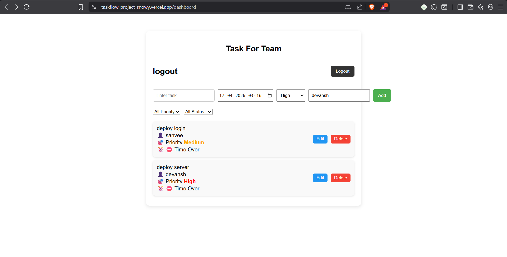

# 🚀 TaskFlow - Full Stack Task Management App

TaskFlow is a full-stack web application that allows users to manage their daily tasks efficiently with authentication, priority handling, and deadlines.

## 🌐 Live Demo

Frontend: https://taskflow-project-snowy.vercel.app
Backend API: https://taskflow-project-q3af.onrender.com

## 📌 Features

* 🔐 User Authentication (JWT based)
* 📝 Create, Read, Update, Delete (CRUD) Tasks
* 📅 Add deadlines to tasks
* ⚡ Set task priority (Low / Medium / High)
* 👥 Assign tasks
* 🔄 Real-time UI updates
* 🌐 Fully deployed (Frontend + Backend + Database)

## 🛠️ Tech Stack

Frontend: React.js, HTML5, CSS3, JavaScript (ES6+)
Backend: Node.js, Express.js
Database: MongoDB Atlas
Deployment: Vercel (Frontend), Render (Backend)

## 📂 Project Structure

taskflow-project/
├── frontend/
│   ├── public/
│   ├── src/
│   │   ├── components/
│   │   ├── pages/
│   │   ├── dashbord.js
│   │   └── App.js
├── backend/
│   ├── config/
│   │   └── db.js
│   ├── middleware/
│   │   └── auth.js
│   ├── models/
│   │   └── tasks.js
│   ├── routes/
│   │   ├── taskRoutes.js
│   │   └── authroutes.js
│   └── server.js

## 🔐 Authentication Flow

1. User signs up or logs in
2. Server generates JWT token
3. Token stored in browser (localStorage)
4. Token sent with every request using: Authorization: Bearer <token>
5. Backend verifies token for protected routes

## ⚙️ Environment Variables

Backend (.env):
PORT=5000
MONGO_URI=your_mongodb_connection_string
JWT_SECRET=your_secret_key

Frontend (.env):
REACT_APP_API_URL=https://taskflow-project-q3af.onrender.com

## 🚀 Run Locally

git clone https://github.com/your-username/taskflow-project.git
cd taskflow-project

Backend:
cd backend
npm install
npm start

Frontend:
cd frontend
npm install
npm start

## 🧪 API Endpoints

POST /api/auth/signup - Register user
POST /api/auth/login - Login user
GET /api/tasks - Get all tasks
POST /api/tasks - Create new task
PUT /api/tasks/:id - Update task
DELETE /api/tasks/:id - Delete task

## ⚠️ Known Issues

Backend may take 10–30 seconds to respond initially due to Render free tier sleep mode

## 📈 Future Improvements

* Refresh Token Authentication
* Analytics Dashboard
* Mobile Responsive UI
* Notification System
* AI-based Task Suggestions

## 📸 Screenshots

## 👨‍💻 Author

Devansh Bhargava
BTech CSE (AIML), Oriental College of Technology, Bhopal

## ⭐ Support

If you like this project, please give it a star ⭐

## 📬 Contact

Email: [bhargavadevansh85@gmail.com](mailto:bhargavadevansh85@gmail.com)
LinkedIn: https://www.linkedin.com/in/devansh-bhargava-29a5b4281
GitHub: https://github.com/devanshbhargava
